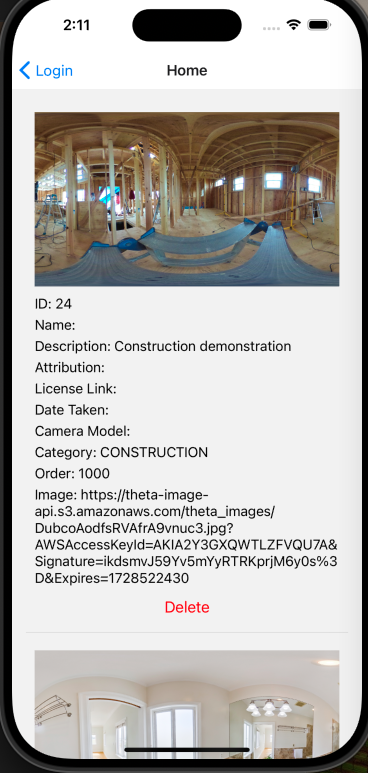
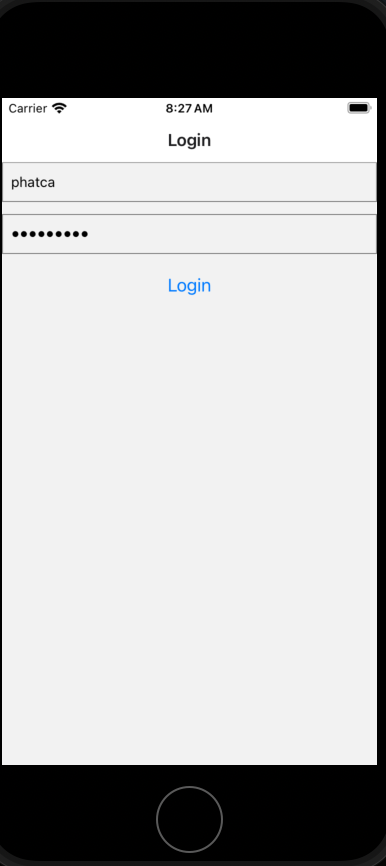
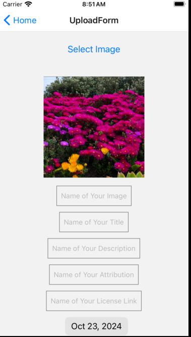

# Using JSON Web Token with iOS React Native



Be aware that images uploaded to the server are automatically published
publicly using direct server connection to the database.  Do not upload
private images.

## Running Locally

```text
npm install
npm start
```

### For Android

```bash
# using npm
npm run android
```

### For iOS

```bash
# using npm
npm run ios
```

## API Authentication Information

username: tutorial
password: theta360DotGuide

Do not upload private images.  This is a public playground for testing.

## Troubleshooting

[Unable to load contents of file list](https://stackoverflow.com/questions/55505991/xcode-10-2-update-issue-build-system-error-1-unable-to-load-contents-of-file-l)

```text
pod deintegrate
pod install
```

## Article: Setting Up Django for Secure 360 Image Management with JWT

[JSON Web Token](https://en.wikipedia.org/wiki/JSON_Web_Token)
(JWT) is a standard for transmitting information securely.
JWT is used to display, upload and delete information from an
API server.

To run a REST command such as display image or delete image using JWT, your
application must first request a JWT token from the backend server.

To serve a REST API with JWT authentication using Django, you need the packages
`djangorestframework` and `djangorestframework-simplejwt`.

The packages will handle token generation, security, and REST management.

Here's a step-by-step guide on how to set it up:

1. Set up Django and Django REST Framework (DRF)
First, ensure you have a Django project set up with Django REST Framework (DRF) installed:

```bash
pip install django djangorestframework
```

Add 'rest_framework' to your INSTALLED_APPS in settings.py:

```python
INSTALLED_APPS = [
    # Other apps...
    'rest_framework',
]
```

2. Install Django REST Framework Simple JWT
For JWT-based authentication, install the djangorestframework-simplejwt package:

```bash
pip install djangorestframework-simplejwt
```

Then, add rest_framework_simplejwt to your INSTALLED_APPS:

```python
INSTALLED_APPS = [
    # Other apps...
    'rest_framework_simplejwt',
]
```

3. Configure JWT Authentication in settings.py
Update the REST_FRAMEWORK settings to use JWT for authentication:

```python
REST_FRAMEWORK = {
    'DEFAULT_AUTHENTICATION_CLASSES': (
        'rest_framework_simplejwt.authentication.JWTAuthentication',
    ),
    'DEFAULT_PERMISSION_CLASSES': (
        'rest_framework.permissions.IsAuthenticated',
    ),
}
```

4. Create JWT Views for Token Handling
In your urls.py file, set up paths for obtaining and refreshing tokens:

```python
from django.urls import path
from rest_framework_simplejwt.views import (
    TokenObtainPairView,
    TokenRefreshView,
)

urlpatterns = [
    path('api/token/', TokenObtainPairView.as_view(), name='token_obtain_pair'),
    path('api/token/refresh/', TokenRefreshView.as_view(), name='token_refresh'),
]
```

TokenObtainPairView: Returns an access token and refresh token.
TokenRefreshView: Refreshes the access token using the refresh token.

5. Creating a Simple API View
Now, you can create a simple API view that requires authentication:

```python
from rest_framework.views import APIView
from rest_framework.response import Response
from rest_framework.permissions import IsAuthenticated

class ProtectedAPIView(APIView):
    permission_classes = [IsAuthenticated]

    def get(self, request):
        return Response({"message": "You are authenticated!"})
```

Then, add this view to your urls.py:

```python
urlpatterns = [
    path('api/protected/', ProtectedAPIView.as_view(), name='protected'),
    # JWT token paths
    path('api/token/', TokenObtainPairView.as_view(), name='token_obtain_pair'),
    path('api/token/refresh/', TokenRefreshView.as_view(), name='token_refresh'),
]
```

6. Using the API
To authenticate, you'll first obtain a JWT token by sending a POST request to /api/token/ with valid user credentials (e.g., username and password). The response will include an access token (for authorization) and a refresh token (for getting a new access token when it expires).

```bash
POST /api/token/
{
  "username": "your_username",
  "password": "your_password"
}
```

You'll get a response like:

```json
{
  "refresh": "your_refresh_token",
  "access": "your_access_token"
}
```

Then, include the access token in the Authorization header when making requests to protected endpoints:

```makefile
Authorization: Bearer your_access_token
```

7. Token Expiration and Refreshing
When the access token expires, you can refresh it using the refresh token by sending a POST request to /api/token/refresh/:

```bash
POST /api/token/refresh/
{
  "refresh": "your_refresh_token"
}
```

You'll receive a new access token in the response.

8. Optional: Customizing Token Payload or Expiration
You can also customize JWT behavior in settings.py. For example, to modify the token expiration time:

```python
from datetime import timedelta

SIMPLE_JWT = {
    'ACCESS_TOKEN_LIFETIME': timedelta(minutes=5),
    'REFRESH_TOKEN_LIFETIME': timedelta(days=1),
    # other settings...
}
```

### Next Steps

You now have a Django application serving a REST API with JWT authentication. You can create additional views and restrict access using the JWT token. For more advanced use cases, you can further customize the JWT payload, token lifetime, and authentication logic.

### Try Out Live Servers

#### Oppkey API Developer Demonstration Server

You can access the APIs for the Oppkey Django server here:

<https://image360.oppget.com/api/>

```text
username: tutorial
password: theta360DotGuide
```

This [example](https://github.com/PhatCa/reactNativeTheta360/blob/8b5954db3a41d73bb8fc4475fe850b4ebf752d99/App.tsx#L83) shows how to use a token.

```javascript
const response = await fetch('https://image360.oppget.com/api/user-photo/', {
method: 'GET',
headers: {
    'Authorization': `Bearer ${accessToken}`,
    'Content-Type': 'application/json',
},
});
```


# Phase II

At this stage of the application, users are able to use their credentials to log in to the app and receive a JWT token, which is stored in LocalStorage. After that, users are directed to the Home screen, where the app fetches all images belonging to them using their JWT credentials. On the Home screen, besides viewing the image listing, users also have the option to delete selected images. Additionally, there is an option for users to upload images to the database for testing using the "Upload Image" button.

Login View


Home Page


Upload Form


> **Note**: For the License Link, you need to specify the protocol (`http` or `https`) and the full domain. For example, use `https://www.yourlicense.com`.


## Features

The majority of the implementation and features are currently in App.tsx, which is not best practice for React Native as it’s recommended to break down functionality into separate components. I plan to refactor each feature into its own component for better readability and adherence to best practices. This restructuring will enhance the code organization and maintainability.

### User Authentication
To implement secure user access, we added a basic token-based authentication system to the app. Our goal was to allow users to log in with credentials that would be verified by a backend server, with successful authentication granting access to the main app features. Below are the steps we used to implement this feature:

1. Code Snippet for User Login:

App.tsx:
```react-native
const LoginScreen = ({ navigation }) => {
  const [username, setUserName] = useState('');
  const [password, setPassword] = useState('');
  const [errorMessage, setErrorMessage] = useState('');

  const handleLogin = async () => {
    try {
      const response = await fetch('https://image360.oppget.com/api/token/', {
        method: 'POST',
        headers: {
          'Content-Type': 'application/json',
        },
        body: JSON.stringify({
          username,
          password,
        }),
      });

      if (response.ok) {
        const data = await response.json();
        if (data.access) {
          await AsyncStorage.setItem('accessToken', data.access);
          await AsyncStorage.setItem('refreshToken', data.refresh);
          console.log('Access token saved successfully:', data.access);

          // Navigate to the Home screen
          navigation.navigate('Home');
        } else {
          setErrorMessage('No access token found');
        }
      } else {
        const data = await response.json();
        setErrorMessage(data.message);
      }
    } catch (error) {
      setErrorMessage('An error occurred: ' + error);
    }
  };

  return (
    <SafeAreaView style={styles.container}>
      <TextInput
        style={styles.input}
        placeholder="Username"
        value={username}
        onChangeText={setUserName}
      />
      <TextInput
        style={styles.input}
        placeholder="Password"
        secureTextEntry
        value={password}
        onChangeText={setPassword}
      />
      {errorMessage ? <Text style={styles.error}>{errorMessage}</Text> : null}
      <Button title="Login" onPress={handleLogin} />
    </SafeAreaView>
  );
};
```

2. Login Screen Setup:
- The app provides a LoginScreen component for user login, managed with React’s useState hooks to handle the username, password, and errorMessage states. These states help manage the form inputs and display error messages if login attempts fail.

3. Login Process:
- The handleLogin function within LoginScreen is the core of the login process. This function executes when the user taps the “Login” button, attempting to authenticate with the backend server.

- Within handleLogin, the app sends a POST request to an API endpoint (https://image360.oppget.com/api/token/) with username and password in the request body.

- The request is crafted using the fetch API, and headers include Content-Type: application/json to specify JSON format for the data.

4. Response Handling:
- If the server responds with a success status, the app checks if an access token is included in the response.

- If an access token is received, the user is redirected to the Home screen via navigation.navigate('Home'). This navigation happens right after the token check, creating a seamless transition from login to the authenticated home view.


### JWT Token Storage
To securely manage user sessions, we implemented JWT token storage within the app. This setup allows the app to persist user authentication between sessions by storing tokens on the device, providing a seamless experience while maintaining security. Below are the steps we used to implement this feature:

1. Code Snippet for Token Storage:

App.tsx:
```react-native
if (data.access) {
  await AsyncStorage.setItem('accessToken', data.access);
  await AsyncStorage.setItem('refreshToken', data.refresh);
  console.log('Access token saved successfully:', data.access);

  // Navigate to the Home screen
  navigation.navigate('Home');
} else {
  setErrorMessage('No access token found');
}
```
2. Access and Refresh Token Management:
- Upon receiving tokens, the app stores both accessToken and refreshToken in AsyncStorage. 
- Storing tokens locally allows the app to access them quickly when making subsequent requests, avoiding unnecessary reauthentication.

3. Security Consideration:
- By using AsyncStorage for token storage, we ensure that sensitive information is retained securely and can be accessed when the app needs to verify user sessions.
- In addition by storing tokens rather than sensitive credentials (like the username and password) in AsyncStorage, the app reduces security risks. In the event of a malicious attack or unauthorized access, users’ actual credentials remain safe, as only the tokens are stored.

### Image Fetching
To enhance the user experience, we implemented an image-fetching feature on the home screen that retrieves and displays user-specific images upon login. This feature relies on authenticated API requests to fetch content securely. Below are the steps we used to implement this feature:

1. Code Snippet for Image Fetching:

App.tsx:
```react-native
const HomeScreen = ({ navigation }) => {
  const [data, setData] = useState(null);
  const [loading, setLoading] = useState(true);
  const [error, setError] = useState(null);

  const fetchData = async () => {
    try {
      const accessToken = await AsyncStorage.getItem('accessToken');
      if (!accessToken) {
        throw new Error('No access token found');
      }
      const response = await fetch('https://image360.oppget.com/api/user-photo/', {
        method: 'GET',
        headers: {
          'Authorization': `Bearer ${accessToken}`,
          'Content-Type': 'application/json',
        },
      });
      if (!response.ok) {
        throw new Error('Failed to fetch images');
      }
      const data = await response.json();
      setData(data);
    } catch (error) {
      setError(error.message);
    } finally {
      setLoading(false);
    }
  };

  useEffect(() => {
    fetchData();
  }, []);
}
```
2. Authenticated API Request:
- The fetchData function retrieves an access token from AsyncStorage and uses it in the Authorization header to securely request images from the backend. This ensures that only authenticated users can access this content.

3. Error Handling and Loading State:
- Error handling is implemented to catch and display any issues during the fetch request. Additionally, a loading state is set while the request is in progress, improving the user experience by providing feedback.

4. Security Considerations:
- By using the accessToken from secure storage and ensuring that images are fetched only for authenticated users, this feature maintains security while offering personalized content.

### Image Deletion
To allow users greater control over their content, we implemented an image deletion feature on the home screen. This feature enables users to remove unwanted images securely and ensures that deletion requests are handled through authenticated API calls. Below are the steps we used to implement this feature:

1. Code Snippet for Image Deletion:

App.tsx:
```react-native
const deleteImage = async (imageId) => {
  try {
    const accessToken = await AsyncStorage.getItem('accessToken');
    if (!accessToken) {
      throw new Error('No access token found');
    }
    const response = await fetch(`https://image360.oppget.com/api/user-photo/${imageId}/`, {
      method: 'DELETE',
      headers: {
        'Authorization': `Bearer ${accessToken}`,
        'Content-Type': 'application/json',
      },
    });
    if (!response.ok) {
      throw new Error('Failed to delete image');
    }
    console.log('Image deleted successfully');
  } catch (error) {
    console.error(error.message);
  }
};
```
2. Authenticated Deletion Request:

- The deleteImage function retrieves the accessToken from AsyncStorage and includes it in the Authorization header, enabling only authenticated users to delete images. This secure request removes the specified image from the backend.

3. Error Handling:

- The function includes error handling to catch any issues during the deletion process, displaying an error message if the request fails or if authentication is not available (where token expired).

4. User Interface Update:

- After a successful deletion, the app logs a confirmation and can update the UI to reflect the change, such as removing the deleted image from view or refreshing the image list.

### Image Upload
The image upload form allows users to select, customize, and upload images with metadata like title, description, and date taken. This feature includes image selection, compression, and authenticated uploads to the server. During implementation, I encountered challenges with image sizing and date compatibility, which are explained in detail below.

src/UploadForm.js
```react-native
const uploadImage = async () => {
  if (!imageUri) {
    Alert.alert('Please select an image first');
    return;
  }
  if (!title) {
    Alert.alert('Please provide a title.');
    return;
  }

  try {
    const compressedImageUri = await compressImage(imageUri);

    const formData = new FormData();
    const modifiedImageName = imageName.endsWith('.jpg') ? imageName : `${imageName}.jpg`;

    formData.append('image', {
      uri: compressedImageUri,
      name: modifiedImageName,
      type: 'image/jpeg',
    });
    formData.append('title', title);
    formData.append('description', description);
    formData.append('attribution', attribution);
    formData.append('license_link', licenseLink);
    formData.append('date_taken', dateTaken.toISOString().split('T')[0]);
    formData.append('camera_model', cameraModel);
    formData.append('category', category);
    formData.append('order', order);
    const token = await AsyncStorage.getItem('accessToken');
    setUploading(true);

    const response = await axios.post(
      'https://image360.oppget.com/api/upload-photo/',
      formData,
      {
        headers: {
          'Content-Type': 'multipart/form-data',
          Authorization: `Bearer ${token}`,
        },
      }
    );

    Alert.alert('Image uploaded successfully!');
    console.log('Server response:', response.data);
  } catch (error) {
    console.log('Error Response:', error.response);
    Alert.alert('Upload failed: ' + error.message);
  } finally {
    setUploading(false);
  }
};
```
2. Image Selection and Compression:
- The pickImage function lets users select an image from their gallery, and compressImage resizes it to optimize upload performance.

> **Difficulty that I found**: When I first worked with this feature, I did not use compressImage to resize the image. As a result, for some images, I encountered an error indicating they were too large, and the server timed out and rejected the request when I attempted to upload them. 

3. Form Fields for MetaData:
- Additional form fields enable users to enter metadata such as title, description, camera model, license, and category. Each field is stored in state and appended to formData for the upload request.

> **Compatibility Challenge**: Because we are using a Django setup for the backend with a DateField for the date, I initially had to research compatibility. I found that DateTimePicker is a useful package for React Native, providing a well-designed UI component for iOS and formatting the date correctly to match our backend implementation.

4. Authenticated Upload Request:
- The uploadImage function retrieves the accessToken from AsyncStorage and includes it in the request headers to ensure only authenticated users can upload images. The function then sends the image and metadata to the server.

5. Error Handling:
- If any required fields are missing, alerts prompt users to complete them. The app also includes error handling for upload failures, displaying an alert with a descriptive message.

## New Package in Phase II
- DateTimePicker : using for date field

```react-native
<DateTimePicker
    testID="dateTimePicker"       // Identifier for testing purposes
    value={dateTaken}             // Current selected date
    mode="date"                   // Mode to show only date (can be 'date', 'time', or 'datetime')
    display="default"             // Display style ('default', 'spinner', 'calendar', etc.)
    onChange={chooseDate}         // Function to handle date change event
/>

```

- ImageResizer : resize and compress image to send over to the api post method

```react-native
const compressImage = async (imageUri) => {
  try {
    const response = await ImageResizer.createResizedImage(
      imageUri,       // Image URI to compress
      800,            // Width of the resized image
      600,            // Height of the resized image
      'JPEG',         // Format of the image ('JPEG', 'PNG', etc.)
      80              // Quality of the compressed image (0-100)
    );
    return response.uri;   // Returns the URI of the resized image
  } catch (error) {
    console.error(error);
    Alert.alert('Image compression failed: ' + error.message);
  }
};
```

- Image Picker: To access image and select image in gallery

```react-native
const pickImage = () => {
    launchImageLibrary({ mediaType: 'photo' }, (response) => {
      if (response.didCancel) {
        Alert.alert('Image selection canceled');
      } else if (response.errorMessage) {
        Alert.alert('Error: ' + response.errorMessage);
      } else {
        const uri = response.assets[0].uri;
        setImageUri(uri);
      }
    });
  };

```

> **Note**: For IOS, you need to modify the Info.plist file to request access to photo library

```xml
<key>NSPhotoLibraryUsageDescription</key>
<string>We need your permission to access the photo library</string>
```

## Steps for Usage with Phase II:
1. Run `npm install`
2. cd into IOS run `pod install`

## Phase III

* implement image viewer with marizipano in a webview
* have two conditions:
  1. image is on image360.oppget.com
  2. image is already downloaded from image360.oppget.com and stored in camera roll of iOS
  

### Trouble shooting
1. Image Not Displaying in Webview

The WebView loads the viewer.html file, and an imageUrl variable is passed to the html. However, no image is being rendered possible error coming from passing imageUrl over to viewer.html?

2. Lack of Debugging Console Logs in WebView

Currently, there is no logging mechanism for debugging directly in the WebView. console.log statements in viewer.html do not display in the mobile console, making it challenging to diagnose issues within the WebView.
